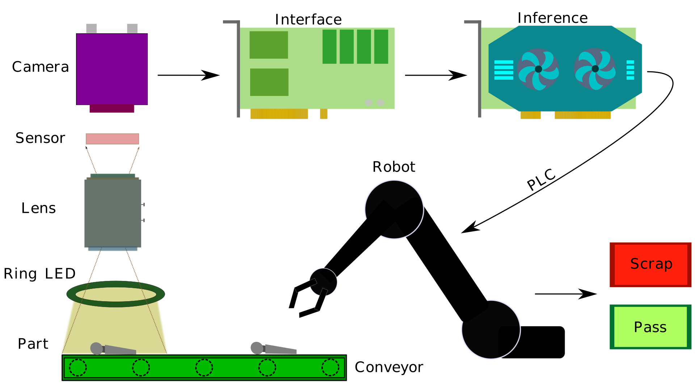

# Deep Learning and Machine Vision: Overview

## Intro

Some will argue that deep learning (DL), a subset of artificial intelligence (AI), has proven itself to be the technology of the future. 
The secret to this success lies in the large amount of data needed to train DL algorithms which achieve human level accuracy. 
However, it seems as if there is one final test remaining for DL; defect detection in the manufacturing environment. More specifically, 
many manufacturing processes have been fine-tuned to eliminate the majority of defects, tasking DL with a major challenge; training on a 
very limited amount of data. It turns out that this challenge can be overcome by having quality instead of quantity data via the means of 
machine vision (MV). In this blog, I will explain what MV is and its different components.

## Machine vision

Many of us have heard of computer vision (CV), but not too many are familiar with the concept of machine vision (MV). As you may know, 
the CV field focuses on low-level and high-level image processing tasks such as interpolation, filtering, edge detection, segmentation, 
classification, and many more. The main idea behind CV is making sense of data while not having any control over how the data is generated. 
The CV applications include image restoration, motion analysis, object recognition, and 3D reconstruction, to name the few.
On the other hand, MV too aims at making sense of data, but unlike CV, it has control over the imaging system. More specifically, 
MV pipeline entails data capture mechanism, data analysis process, as well as the decision making process in the form of a physical action. 
This makes MV very suitable for the manufacturing environment where the objective is defect detection. The simplest data collection mechanism 
contains a camera, lens, and a light source. Furthermore, the physical action may be parts sorting, while the data analysis process shares 
the same underlying technology as the CV (edge detection, object segmentation, classification, etc.).

Typical MV system is presented in the above figure. The inspection process starts the moment when the part is placed on a moving conveyor belt. 
As the part travels down the conveyor belt, it passes under the well illuminated field-of-view (FOV) of the lens. The lens focuses the image 
onto the imaging sensor (array of pixels) which converts the analog signal into the digital one (image). Camera electronics is responsible 
for controlling, pre-processing, and further sending the image to the host computer via interface. This interface could be a network card, 
USB card or a dedicated image processing hardware called framegrabber. In addition, the digital image is sent to CPU or GPU for inference 
which results in a decision (binary classification;pass vs fail, multi-class classification; different defect type, etc.). The output of 
inference is communicated to a programmable logic controller (PLC) which in turn instructs the robot to pick the part of the conveyor belt and 
to place it in the appropriate bin (pass vs fail). This process repeats all over again for many days, months, and even years.

## Quality not quantity data

Carefully designing a MV system ensures the following:
- High resolution image; there are enough pixels to be able to resolve the smallest defect
- High contrast image; there is a good contrast between background and foreground (defect)
- Uniformly illuminated image; there is even light distribution across the FOV
- Distortion-free image; the system is calibrated ensuring sharp focus, good color reproduction, and lens error correction

A MV system that delivers the data following the above points will result in a good quality data; high resolution, high contrast, 
uniform, and noise free.

## Conclusion

Deep learning needs to prove itself to be useful in a manufacturing environment where there is a limited number of data available. 
Leveraging the machine vision framework to get good quality data is crucial to this success. MV is a multidisciplinary field that 
requires knowledge of light and its interaction with objects, optics, sensors and cameras, as well as automation and robotics.
